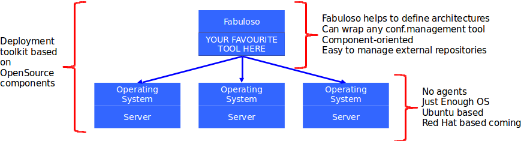

.. FABuloso documentation master file, created by
   sphinx-quickstart on Wed Sep 25 14:17:30 2013.
   You can adapt this file completely to your liking, but it should at least
   contain the root `toctree` directive.

FABuloso: OpenStack deployments
===============================

**FABuloso** is a python tool to easily organize and deploy an `OpenStack <http://www.openstack.org>`_ architecture using `Fabric <http://docs.fabfile.org/>`_. *FABuloso* manages configuration with **components** within **catalogs**. For a more deeper insight about what *FABuloso* does and how it does, take a look at the diagram bellow and the :ref:`introduction <introduction>` page, where we explain the different parts that build *FABuloso*.

Once you understand what *FABuloso* does, you can see the `installation <install.html>`_ and `quickstart <quickstart.html>`_ guides to start deploying your first OpenStack architecture.

Contents:

.. toctree::
    :maxdepth: 2

    introduction
    install
    quickstart
    shell
    python-api

Indices and tables
==================

* :ref:`genindex`
* :ref:`modindex`
* :ref:`search`
